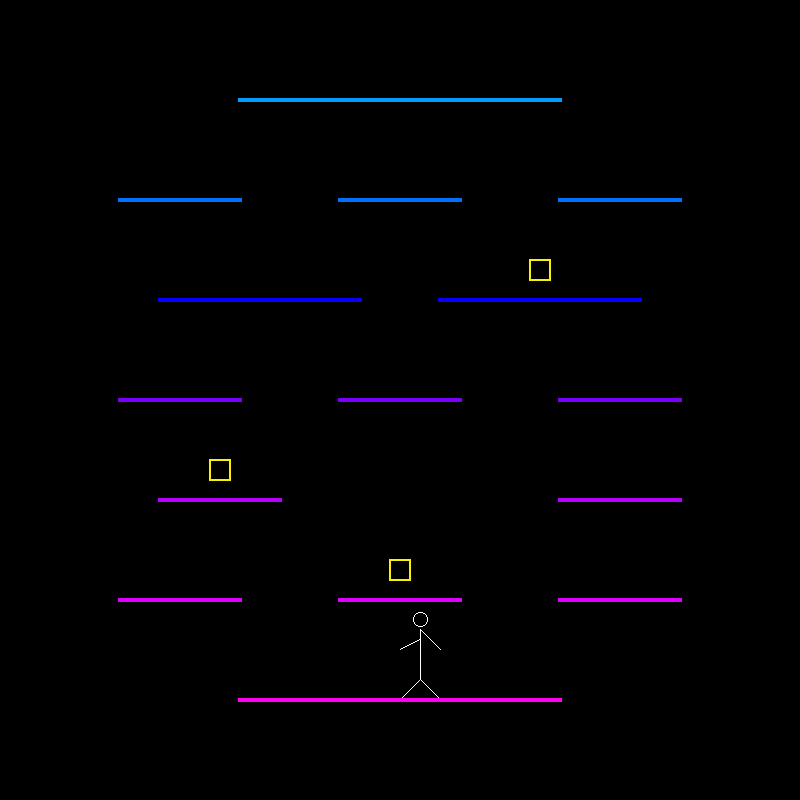

# CSE423: Computer Graphics

A simple stickman platforming game created using the OpenGL library on Jupyter Notebook. The initial concept is provided in [Game Proposal](./Simple-Stickman-Platforming-Game/Project%20Proposal_Simplified%20Stickman%20Platforming%20Game.pdf)

**Initial Game Setup**:

**Reach the top to *WIN*.**

**Or, fall to your demise for *GAME OVER.***

